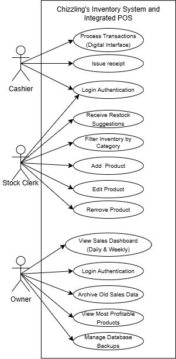
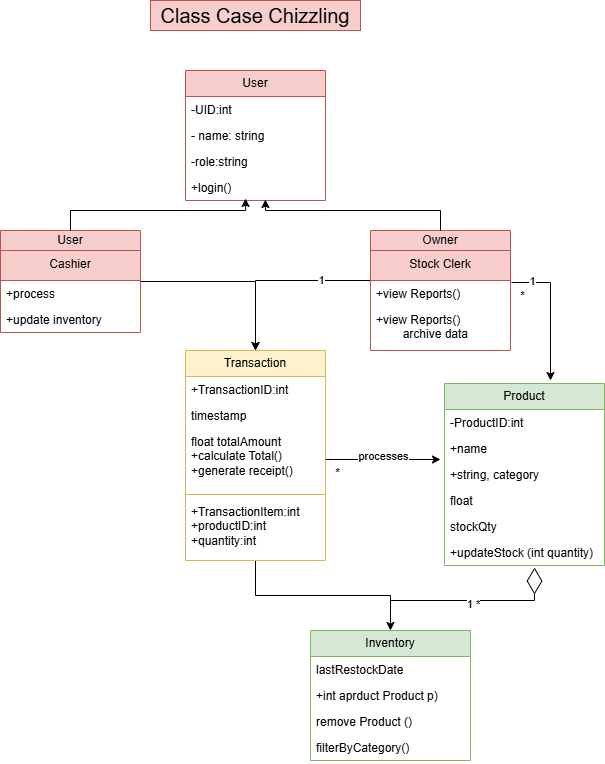

**1. Architectural Style**

The Model–View–Controller (MVC) architectural style was chosen because it separates the system into organized parts, making the system easier to develop and manage. Each component has a specific role, which helps reduce complexity and confusion during development.

**2. High-Level Architecture Diagram**

   **a.Use Case Diagram**
   
   
   
   **b.Class Diagram**
   
   

**3. Design Principles Applied (at least 2)**

**a. Separation of Concerns**
- This ensures that sales processing, inventory management, and reporting are handled independently, making the system easier to maintain and update without affecting other components.

**b. Modularity**
- The system is divided into modules such as POS, Inventory, and Reports, allowing each part to be developed, tested, and improved separately.

Constantino, Raxell Louis I. - Luhwiss (raxellcons26@gmail.com)

Contreras, David Jeremy N. - jaisemori (basura974@gmail.com)
